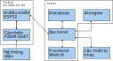
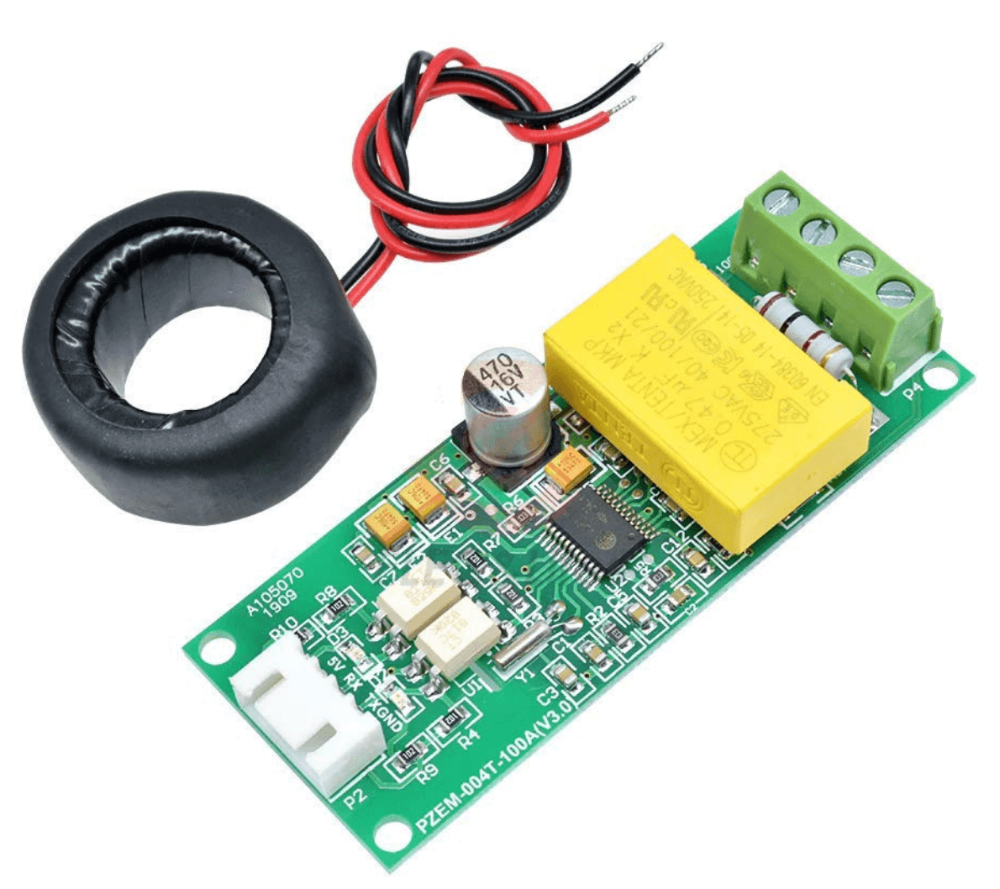
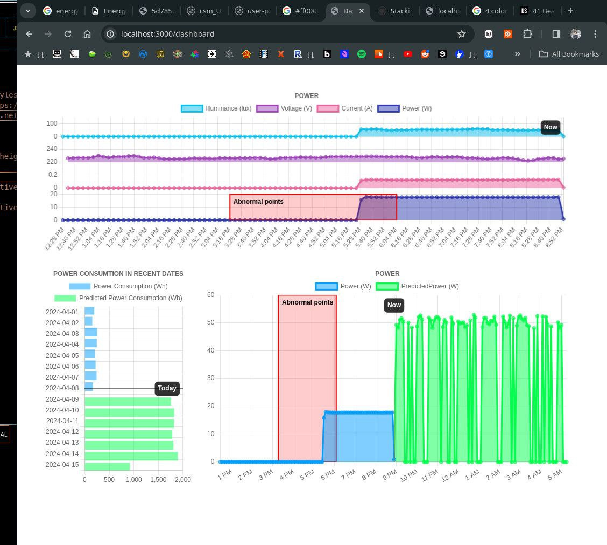

# Energy_Forecast

Industrial AI system for energy forecast

## Mô hình hệ thống

  *Sơ đồ khối hệ thống*

### Cảm biến PZEM-004T

Cảm biến năng lượng, đọc được các thông số:

- Dòng điện
- Điện áp
- Công suất
- Tần số
- Power factor

### Vi điều khiển

Vi điều khiển đọc cảm biến thông qua giao tiếp UART, để lấy mẫu dữ liệu:

- Dòng điện
- Điện áp
- Công suất

Sau đó gửi lên server thông qua giao thức HTTP/MQTT. Thông tin gửi lên gồm:

- Địa chỉ MAC của thiết bị
- Dòng điện
- Điện áp
- Công suất
- Thời điểm lấy mẫu

Hiện tại, em chỉ đang để chu kỳ lấy mẫu là 5 phút 1 lần.

### Backend

Backend cung cấp các API cho các bên truy cập: Thiết bị thu thập, frontend, AI
engine và các thiết bị khác.

Sau khi server nhận được packet gửi lên từ thiết bị, server kiểm tra tính hợp
lệ và xác thực của thiết bị. Sau đó, server lưu thông tin từ packet nhận được
cùng với `thời điểm nhận packet` (để phòng trường hợp đường truyền chập chờn)
vào database.

### Frontend

Web UI là một dashboard cho phép người dùng xem biểu đồ được vẽ ra từ dữ liệu
thu thập được và dữ liệu dự đoán.

Web UI còn cho phép người dùng quản lý thiết bị và tải xuống data.

### AI engine

AI engine lấy dữ liệu từ database thông qua backend API, chạy qua model, và lưu
lại output vào database.

AI engine được chạy theo thời gian cài sẵn. Ví dụ: chạy 1 lần vào 0h mỗi ngày.

### Các thiết bị khác

Frontend có thể được tích vào màn hình HMI trong các nhà máy, hỗ trợ việc tích
hợp ứng dụng mô hình này với các dự án khác.

## Mô hình AI

### Dữ liệu

Dữ liệu được lấy mẫu 5 phút một lần => 1 ngày lấy được 288 mẫu. Chu kỳ 
lấy mẫu có sai số ~30s. Một số khoảng thời gian có thể không có mẫu, do 
lỗi mạng, mất điện, nâng cấp server,...

Dữ liệu được host tại API: http://rockwell.eproject.kienlab.com/api/. Hiện tại,
đã thu thập dữ liệu cho 2 thiết bị có địa chỉ MAC:

- `D4:8A:FC:A5:ED:E0`, 1000 mẫu cuối cùng trong database: http://rockwell.eproject.kienlab.com/api/raw?length=-1000&dev_id=D4:8A:FC:A5:ED:E0
- `D4:8A:FC:99:66:68`, 1000 mẫu cuối cùng trong database: http://rockwell.eproject.kienlab.com/api/raw?length=-1000&dev_id=D4:8A:FC:99:66:68

### Mô hình

Hiện tại mô hình AI chỉ sử dụng một feature đầu vào là công suất ở dạng
timeserie, kích thước input = 1000 mẫu (khoảng 4 ngày) và output khoảng 
4 ngày.

## Một số phương án khác

### Chạy model trên vi điều khiển

Một số vi điều khiển có tích hợp DSP, có thể được sử dụng để tính toán cho
một số model AI, làm giảm chi phí cũng như kích thước hệ thống. Tuy nhiên,
hạn chế là hiệu suất và phạm vi ứng dụng không được rộng.

### Deploy mô hình độc lập trong mạng LAN.

Hệ thống trên có thể được sửa đổi lại, thay vì server deploy trên cloud thì
có thể được deploy trên máy tính nhúng. Hệ thống sẽ chạy độc lập trong một 
mạng LAN riêng mà không cần yêu cầu kết nối Internet.